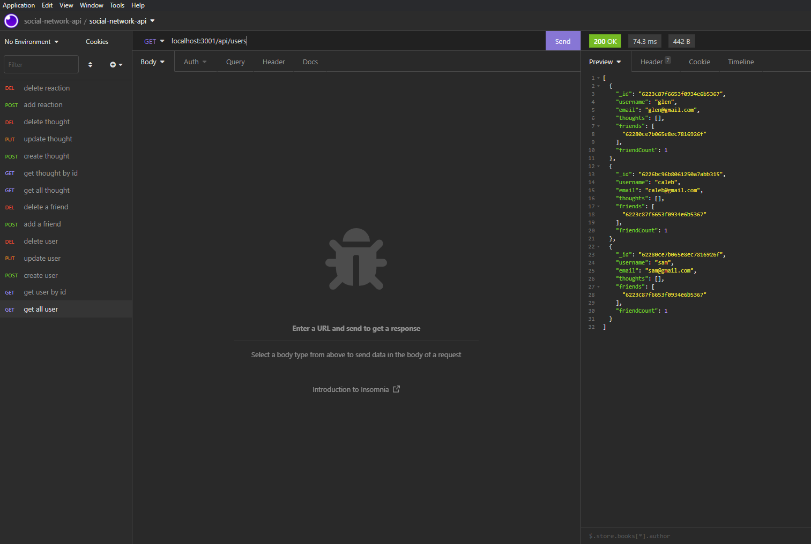
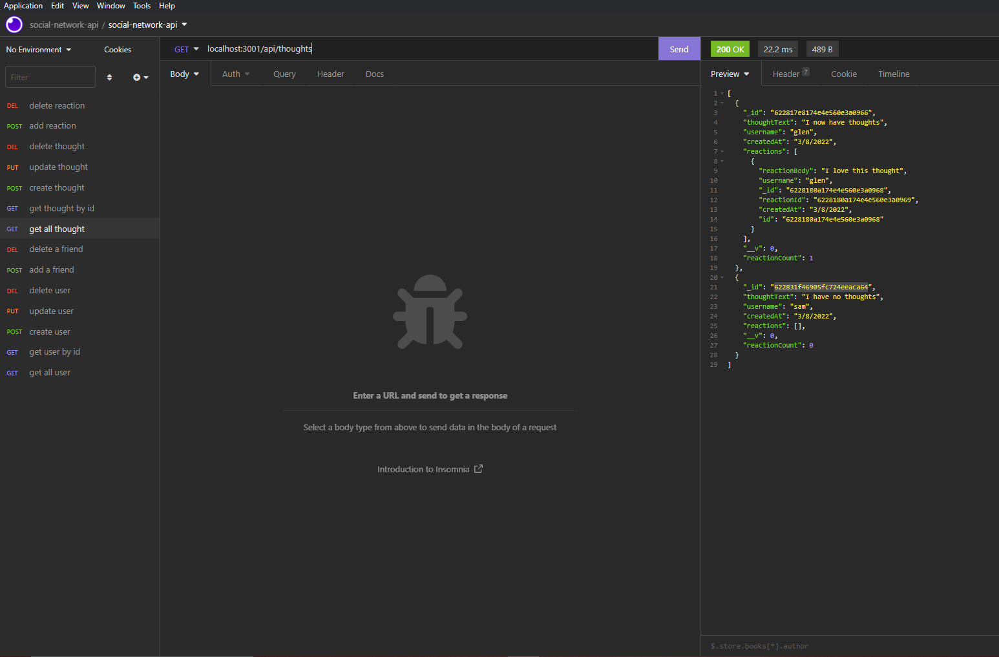

<p align="center">
 </a>
</p>

<h3 align="center">Social Network API</h3>

<div align="center">

[]()
[](https://github.com/glenluersman/social-network-api/issues)
[](https://github.com/glenluersman/social-network-api/pulls)
[](/LICENSE)

</div>

---

## 

- [About](#about)
- [Installing](#installing)
- [Usage](#usage)
- [Built With](#built_using)
- [Authors](#authors)
- [Questions](#questions)
- [Screenshots](#screenshots)

## 

# User Story

```
AS A social media startup
I WANT an API for my social network that uses a NoSQL database
SO THAT my website can handle large amounts of unstructured data
```

# Acceptance Criteria

```
GIVEN a social network API
WHEN I enter the command to invoke the application
THEN my server is started and the Mongoose models are synced to the MongoDB database
WHEN I open API GET routes in Insomnia for users and thoughts
THEN the data for each of these routes is displayed in a formatted JSON
WHEN I test API POST, PUT, and DELETE routes in Insomnia
THEN I am able to successfully create, update, and delete users and thoughts in my database
WHEN I test API POST and DELETE routes in Insomnia
THEN I am able to successfully create and delete reactions to thoughts and add and
```

## 

1. Clone the repository.
2. Run the command `npm install`.
3. Run the command `npm start`.
4. Open Insomnia and test routes.

## 

Screencastify URL: https://drive.google.com/file/d/1qonRdxqF06pPkbLQI0fZeo1zAe8hXufD/view

## 

- Node.js
- Express.js
- Javascript
- Mongoose
- MongoDB

## 

[glenluersman](https://github.com/glenluersman)

## 

- Feel free to open an issue or contact me directly at glen.luersman@gmail.com if you have any questions about the repo. You can find more of my work at [glenluersman](https://github.com/glenluersman/).

## 

</a>

</a>
